# BabyTracker — Science & Methodology

This document explains the scientific background and algorithmic design behind BabyTracker's data-driven features. It is written to be accessible to new parents while remaining technically precise and fully referenced.

Each section covers one feature: what it detects, why the underlying biology matters, how the algorithm works, and what the relevant literature says. The [user manual](user-manual.md) covers day-to-day use; come here when you want to understand the *why*.

---

## Contents

- [1. Cluster Feeding Detection](#1-cluster-feeding-detection)
- [2. Sleep Trend Signal](#2-sleep-trend-signal) *(coming soon)*
- [3. Smarter Feed Prediction (EMA)](#3-smarter-feed-prediction-ema) *(coming soon)*

---

## 1. Cluster Feeding Detection

### What is cluster feeding?

Cluster feeding is a period — typically in the late afternoon or evening — during which a baby feeds much more frequently than usual: several short feeds bunched together within a couple of hours rather than spaced evenly throughout the day.

It is one of the most common sources of anxiety for new parents. The natural instinct is to interpret it as "baby isn't getting enough" or "my supply has dropped." Neither is usually true.

> **In plain terms:** cluster feeding is normal baby behaviour, not a feeding problem.

---

### Why does it happen?

There are several well-supported biological explanations, and they are not mutually exclusive.

#### 1. Preparation for a longer sleep stretch

The most widely cited explanation is that babies load up on calories in the evening to extend their first sleep block of the night. Studies tracking sleep consolidation in the first months of life show that the longest uninterrupted sleep stretch in a 24-hour period almost always follows the evening feed cluster (Henderson et al., 2010).

#### 2. Circadian variation in breast milk composition

Breast milk is not a fixed substance — its composition changes across the day. Evening milk is richer in certain sleep-promoting compounds, particularly tryptophan (the precursor to serotonin and melatonin). The baby's drive to feed more in the evening may be partly a response to lower caloric density of daytime milk or higher energy expenditure during alertness windows (Cubero et al., 2005; Illnerová et al., 1993).

#### 3. The witching hour and nervous system development

In the first 8–12 weeks, many babies have a daily "fussy window" in the late afternoon or evening. This is associated with an immature nervous system that has difficulty self-regulating at the end of a stimulating day. Frequent feeding provides comfort and sensory regulation as well as calories (Riordan & Wambach, 2014).

#### 4. Supply calibration in early breastfeeding

In the first 4–6 weeks, frequent evening feeding helps establish and maintain milk supply by signalling high demand to the body. From this perspective, cluster feeding is a supply-building mechanism as much as it is a hunger response (Mohrbacher, 2010).

---

### What a cluster day looks like

The chart below shows a typical day with cluster feeding. Normal feeds (spaced 2–3 hours apart) are shown in blue; the evening cluster is highlighted in orange.

```
TIME     06   07   08   09   10   11   12   13   14   15   16   17   18   19   20   21   22
          |    |    |    |    |    |    |    |    |    |    |    |    |    |    |    |    |
FEEDS    [F]       [F]       [F]            [F]       [F]            [F] [F][F][F]
                                                                          ←cluster→
INTERVAL      ~2h       ~2h       ~3h            ~2h       ~3h        45m 35m 40m
```

Key observations:
- Morning and afternoon feeds are spaced 2–3 hours apart — a typical pattern
- Evening feeds (19:00–21:00) come every 35–45 minutes
- A longer sleep stretch typically follows the cluster

```mermaid
gantt
    title Example day — cluster feeding in the evening (orange = cluster)
    dateFormat HH:mm
    axisFormat %H:%M

    section Daytime feeds
    Feed 1       : f1, 07:00, 15m
    Feed 2       : f2, 09:15, 15m
    Feed 3       : f3, 11:30, 15m
    Feed 4       : f4, 14:00, 15m
    Feed 5       : f5, 16:30, 15m

    section Evening cluster
    Feed 6       : crit, c1, 19:00, 15m
    Feed 7       : crit, c2, 19:45, 15m
    Feed 8       : crit, c3, 20:25, 15m

    section Night
    Sleep stretch : milestone, s1, 21:00, 0m
```



---

### When is cluster feeding expected?

Cluster feeding is most common in the first 12 weeks and tends to occur daily, not just occasionally. It typically eases as the baby's sleep consolidates and the nervous system matures.

| Baby's age      | Cluster feeding frequency          | Notes |
|-----------------|------------------------------------|-------|
| 0–2 weeks       | Daily, often intense               | Supply establishment phase |
| 2–6 weeks       | Daily, especially in growth spurts | Peak witching-hour period |
| 6–12 weeks      | Most evenings                      | Gradually less intense |
| 3–4 months      | Occasional                         | Sleep architecture shift begins |
| 4 months+       | Rare; usually tied to growth spurts | |

---

### The detection algorithm

BabyTracker detects cluster feeding automatically from the logged events. Here is the decision logic:


**Why each threshold:**

| Parameter | Value | Rationale |
|-----------|-------|-----------|
| Minimum feeds | 3 | Two feeds close together is coincidence; three is a pattern |
| Maximum interval | 45 min | Intervals ≥ 45 min suggest a pause between feeds rather than a cluster. Mohrbacher (2010) uses 60 min; we use 45 to reduce false negatives |
| Window duration | 2.5 hours | Captures the cluster episode as a single block without merging distinct feeding sessions |
| Hour range | 17:00–23:00 | Cluster feeding is an evening phenomenon; applying the chip to a 2am burst of feeds would be misleading |

**Implementation:** `frontend/src/lib/clusterFeeding.ts` — `detectClusters(events: BabyEvent[])`

The algorithm uses a greedy forward scan: it starts at each feed and extends the candidate group as long as consecutive intervals stay under 45 minutes. If the resulting group has ≥ 3 feeds, fits in 2.5 hours, and overlaps the evening window, it is recorded as a cluster episode. This ensures no feed can belong to two clusters simultaneously.

---

### What the app shows

When a cluster is detected, a dismissable information chip appears above the most recent clustered feed in today's timeline:

> *Frequent short feeds in the evening are completely normal — baby is topping up before a longer sleep stretch.*

The chip is intentionally minimal and calm. No warning colours. No alert language. It is there to name what is happening and provide context before the parent reaches for their phone to search "cluster feeding normal?"

The chip is also suppressed from the **feed prediction model**: cluster intervals are excluded when calculating the estimated next feed, so a burst of 40-minute intervals does not make the app predict the next feed in 40 minutes. See [Section 3](#3-smarter-feed-prediction-ema) for details on how this works.

---

### References

| Authors | Year | Title | Journal / Source |
|---------|------|-------|-----------------|
| Mohrbacher, N. | 2010 | *Breastfeeding Answers Made Simple* | Hale Publishing |
| Riordan, J. & Wambach, K. | 2014 | *Breastfeeding and Human Lactation*, 5th ed. | Jones & Bartlett |
| Henderson, J.M.T. et al. | 2010 | Consolidation of nighttime sleep in the first year of life | *Pediatrics* 126(3):e590–e597 |
| Cubero, J. et al. | 2005 | The circadian rhythm of tryptophan in breast milk affects the rhythms of 6-sulfatoxymelatonin and sleep in newborn | *Neuroendocrinology Letters* 26(6):657–661 |
| Illnerová, H. et al. | 1993 | The circadian rhythm in plasma melatonin concentration of the artificially fed infant | *J Clin Endocrinol Metab* 77(3):838–841 |
| Woolridge, M.W. & Fisher, C. | 1988 | Colic, overfeeding, and symptoms of lactose malabsorption in the breast-fed baby | *The Lancet* 332(8607):382–384 |

---

## 2. Sleep Trend Signal

*Documentation coming in the sleep-trend PR.*

---

## 3. Smarter Feed Prediction (EMA)

*Documentation coming in the feed-prediction PR.*
