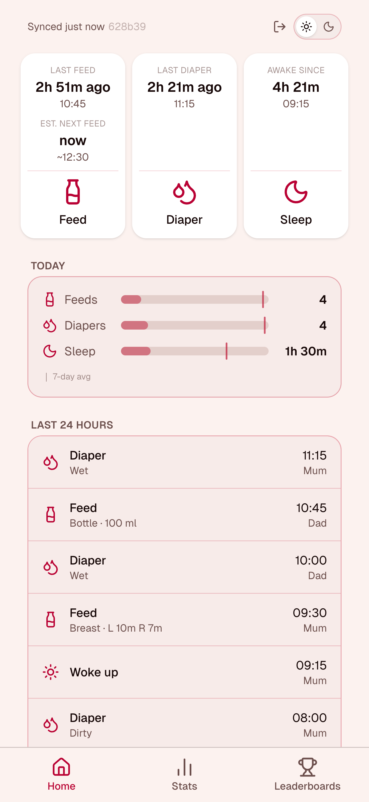
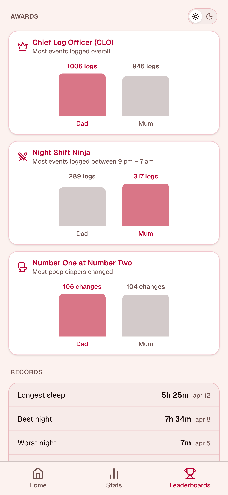
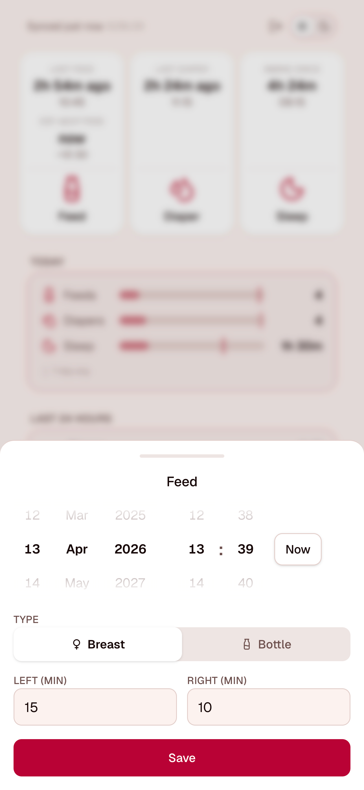
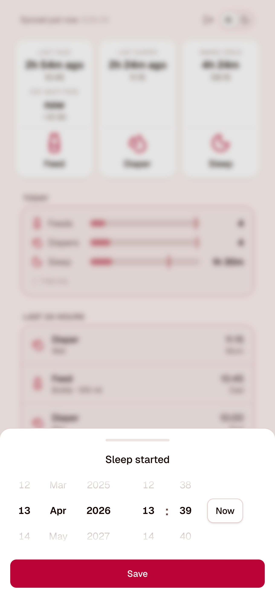
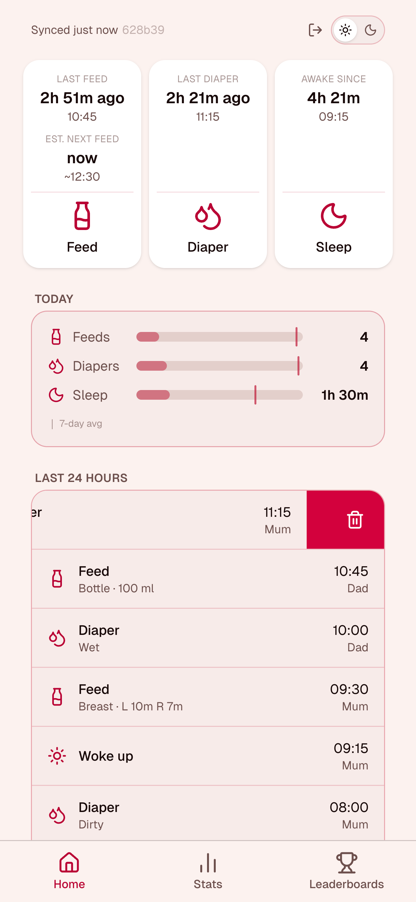
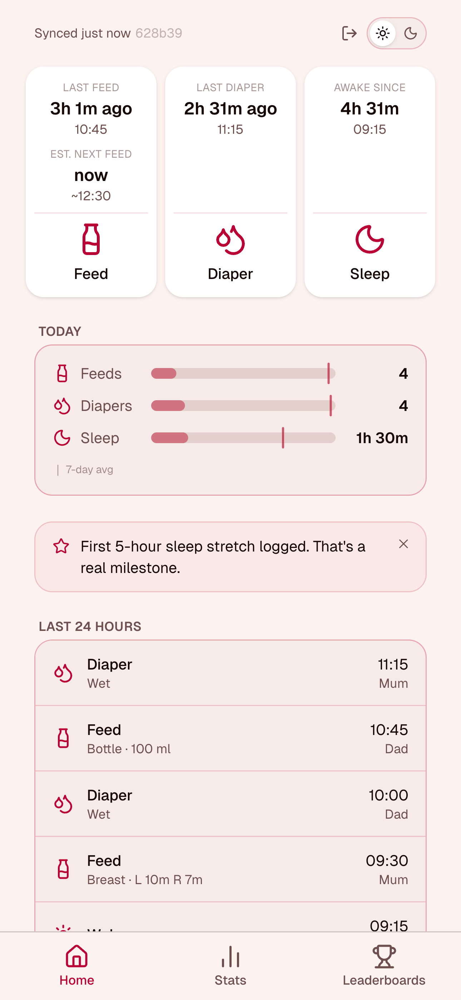
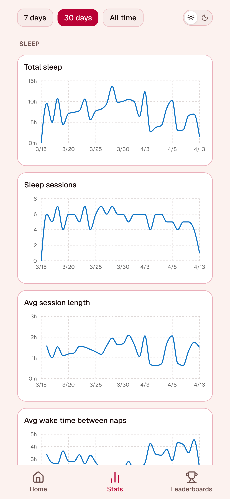
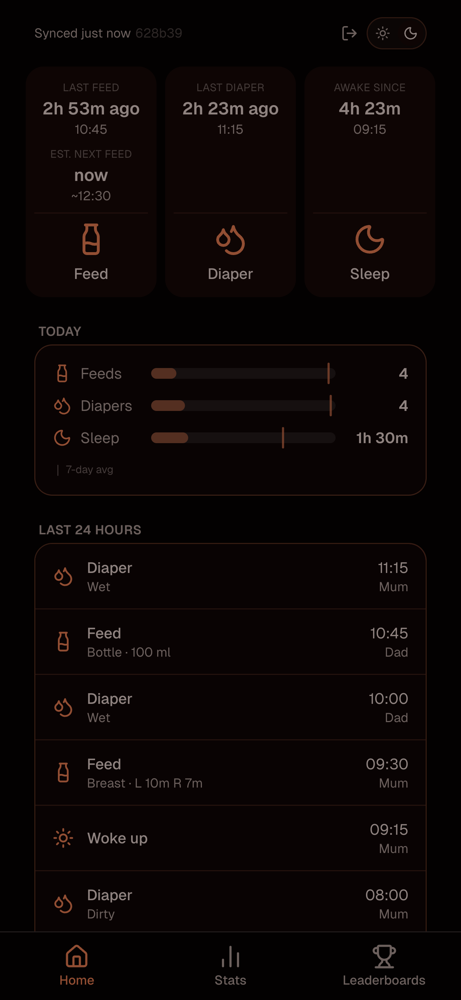

# BabyTracker — User Manual

The first weeks with a newborn are relentless. Feeds blur into each other, sleep happens in fragments, and at 3 am you genuinely cannot remember whether the last nappy was an hour ago or three. BabyTracker is a shared log for two parents — one place to record every feed, sleep block, and diaper change, visible to both of you in real time, no matter who's holding the baby.

Tap once to log. Glance at the screen to see what happened and when. Hand off to your partner without a word — they can see exactly what you saw. Over time the data turns into charts, averages, and the occasional record broken — a longest sleep stretch, a best night ever — so you can tell whether things are actually improving or just feel like they are.

<!-- SCREENSHOT: screenshots/home.png — see screenshots section at the bottom -->


<!-- SCREENSHOT: screenshots/leaderboards.png — see screenshots section at the bottom -->


---

## Table of contents

1. [Logging events](#1-logging-events)
2. [Today's summary](#2-todays-summary)
3. [Today's timeline](#3-todays-timeline)
4. [Encouragement & milestones](#4-encouragement--milestones)
5. [Stats](#5-stats)
6. [Leaderboards](#6-leaderboards)
7. [Night mode](#7-night-mode)
8. [Offline & syncing](#8-offline--syncing)

---

## 1. Logging events

The three buttons at the top of the home screen let you log a feed, toggle sleep, or record a diaper change. Tap a button to open the logging sheet, fill in the details, and tap **Save**.

The time defaults to now. Scroll the date/time wheels to adjust if you're logging something that happened a few minutes ago.

> 💡 **A feed logged a few minutes late is infinitely better than one not logged at all.** If you're exhausted and forget immediately, just log it as soon as you remember with an adjusted time.

<!-- SCREENSHOT: screenshots/home.png
     What to show: The full home screen with the app loaded.
       - Feed button showing "Last feed: 1h 30m ago"
       - Sleep button showing "Asleep since: 45m · 21:15"
       - Diaper button showing "Last diaper: 3h ago"
       - Today's summary visible below (9 feeds, ~14h sleep, 6 diapers)
       - At least the top two timeline rows visible
     Run `poetry run python scripts/seed_screenshots.py` before taking this screenshot.
-->

*The home screen: action buttons with live stats, today's summary, and the event timeline.*

---

### Feed

Choose between **Bottle** or **Breast**:

- **Bottle** — enter the amount in ml.
- **Breast** — enter how many minutes on the left and/or right side. Either side is optional; fill in one or both.

<!-- SCREENSHOT: screenshots/feed-sheet-breast.png
     What to show: The feed logging sheet open, with "Breast" selected.
       - Left side: 12 min, Right side: 8 min filled in
       - The date/time wheel picker visible showing a time like 14:30 today
       - Save button visible at the bottom
     No extra data needed — just open the sheet, select Breast, fill in those values,
     and take the screenshot before tapping Save.
-->

*Logging a breast feed: enter minutes per side, adjust the time wheel if needed, and tap Save.*

> 💡 **What's a normal feed count?** Newborns typically feed 8–12 times per day. Frequent feeding is how babies signal hunger and drive milk supply — feed on demand and log what actually happens rather than trying to hit a target.

### Sleep

Tap **Sleep** to mark that baby fell asleep. The button label changes to **Wake**. Tap **Wake** when baby wakes up. The completed block is counted toward today's total sleep time.

Only one sleep block can be open at a time.

> 💡 **"Sleeping through the night" means 5 hours.** In paediatric research, sleeping through the night is defined as a 5-hour uninterrupted stretch — not 8 hours. If baby is regularly doing 5+ consecutive hours, that's a real milestone worth acknowledging.

### Diaper

Choose **Wet**, **Dirty**, or **Wet + Dirty**, then save. The time defaults to now.

### Adjusting the time

Each logging sheet has a date/time wheel picker with five scrollable columns: **Day**, **Month**, **Year**, **Hour**, **Minute**. Scroll any column to change its value. Flick quickly to skip ahead — the wheels have momentum so a fast swipe carries further. Tap **Now** to reset to the current time.

<!-- SCREENSHOT: screenshots/time-picker.png
     What to show: The date/time wheels inside a logging sheet (feed or diaper).
       - All 5 wheels visible: DD | MMM | YYYY | HH | MM
       - Centre item of each wheel is bold (currently selected value)
       - "Now" button visible to the right
     No extra data needed — just open any logging sheet and scroll one wheel slightly
     so the momentum effect is visible, then take the screenshot.
-->

*Scrollable date/time wheels: flick quickly to skip ahead, or tap Now to reset.*

---

## 2. Today's summary

Below the action buttons you'll see today's totals at a glance. Each metric shows a bar where today's value is filled and a vertical marker shows your 7-day average — a quick way to see whether today is unusually busy or quiet.

| Stat | What it shows |
|------|---------------|
| **Feeds** | Number of feeds logged today vs. 7-day average |
| **Sleep** | Total completed sleep time vs. 7-day average (open blocks not counted) |
| **Diapers** | Number of diaper changes today vs. 7-day average |

> 💡 **What counts as "today"?** The app uses a 5 am boundary rather than midnight — so anything logged before 5 am (the 3 am feed, for instance) is counted as the previous day. This keeps the numbers in line with how parents actually experience a day.

<!-- SCREENSHOT: screenshots/summary.png
     What to show: The Today's summary card, cropped to the card itself.
       - Feed, sleep, and diaper bars each showing a value and the 7-day average marker
       - At least one bar that is clearly above or below its average marker
       - "│ vs 7-day avg" label visible under the bars
     Run `poetry run python scripts/seed_screenshots.py` first.
-->

*Today's summary: each stat bar shows today's total with a marker for the 7-day average.*

### Partner message

If your co-parent is carrying an unusually high or low share of the day's logging, a brief acknowledgement appears below the stats. Examples:

- *"Your partner took the night shift — up logging in the early hours."*
- *"Your partner handled 3+ poop diapers today. Quietly heroic."*
- *"You're both logging today, keeping pace with each other. Teamwork."*

These appear at most once every few days so they stay meaningful rather than becoming background noise.

### Record notifications

When a new all-time record is set today (longest sleep stretch, best night ever, most feeds in a day, most poop diapers in a day), a brief notification appears below the stats with a sparkle icon. Award changes (see [Leaderboards](#6-leaderboards)) also appear here. Records only surface once you have 7 or more days of data.

---

## 3. Today's timeline

All events logged today appear in reverse chronological order (most recent at the top). Each row shows:

- The event type and icon
- Details where applicable (e.g. bottle volume, breast side durations, diaper type)
- The time it was logged
- The name of the caregiver who logged it

<!-- SCREENSHOT: screenshots/timeline.png
     What to show: The timeline section with 5–6 events visible.
       - Mix of feeds (one bottle, one breast), a sleep_start, a sleep_end, a diaper
       - Two different display names (e.g. "Mum" and "Dad") across the rows to show shared logging
       - Crop to just the timeline card, no need for full screen
     Run `poetry run python scripts/seed_screenshots.py` first.
-->

*Today's timeline: mixed event types, times, and who logged each one.*

### Deleting an event

Swipe a row to the left to reveal the red delete button, then tap it. A confirmation dialog appears before the event is permanently removed.

<!-- SCREENSHOT: screenshots/timeline-swipe.png
     What to show: A timeline row half-swiped to the left, showing the red delete button.
       - The row content is translated left, the red trash icon is visible on the right
       - No need to show the confirmation dialog — just the mid-swipe state
     No data script needed — just swipe any row on the seeded timeline.
-->

*Swipe left to reveal the delete button.*

---

## 4. Encouragement & milestones

The app surfaces short, contextual messages throughout the day. These are designed to acknowledge what's actually happening rather than give generic advice.

### Night messages

Between 9 pm and 7 am, if you've logged 3 or more events during the night (or it's been a while since the last one appeared), a brief encouraging message shows on the home screen. Examples:

- *"Night shift. You showed up — that's everything."*
- *"3am is tough. So are you."*
- *"Somewhere another parent is awake right now. You're not alone."*

One message per night, then it rests until the next evening session.

### Baby voice

After enough events have been logged in a day, a short message appears written from the baby's point of view — a light-hearted read on what the day looked like. The message is chosen based on the day's actual patterns:

| Pattern | Example |
|---------|---------|
| 9+ feeds | *"So many feeds today. Every single one answered."* |
| Sleep block ≥ 3 hours | *"That nap was everything."* |
| 20+ total events | *"Big day for a small human."* |
| ≤ 8 total events | *"A slow day. Those are good too."* |
| Default | *"Solid day. Minimal complaints."* |

This reappears at most once every few days to stay fresh.

### Partner recognition

If your co-parent has carried a notably high share of the work today, a short message acknowledges it. These cover total logging share, night-shift logging, and nappy changes — reflecting the less-visible labour that often goes unnoticed.

### Milestones

The first time certain events occur, a milestone card appears to mark it. These include:

- First 5-hour sleep stretch
- First 8-hour sleep stretch
- First 2-hour nap
- 14 hours total sleep in a day
- 8 or 12 feeds in a day
- 8 diapers in a day
- First cluster feed detected
- Both parents logging on the same day for the first time
- Surviving a 2–4 am log entry
- 7 and 30 consecutive days of logging

Each milestone is shown once per user and then not again. At most one milestone surfaces every few days.

<!-- SCREENSHOT: screenshots/milestone.png
     What to show: A milestone card on the home screen.
       - The card with its title and message visible, e.g. "7 days of logging" milestone
       - The ✕ dismiss button visible
     To trigger: open DevTools, run:
       localStorage.setItem('logging_total_days', '7')
       localStorage.removeItem('milestone_logging_days_7')
     Then reload the app.
-->

*Milestone cards surface once the first time a notable threshold is crossed.*

> 💡 **Growth spurts are predictable.** Expect temporary spikes in feeding frequency around 2–3 weeks, 6 weeks, 3 months, and 6 months. These usually last 2–4 days. The baby voice messages will reflect the extra feeding activity — it's not a sign anything is wrong.

---

## 5. Stats

The **Stats** tab shows charts over a chosen date range. Select **7 days**, **30 days**, or **All time** using the buttons at the top.

Available charts:

- **Daily feed count** — how many feeds per day
- **Average feed interval** — average gap between feeds in minutes, per day
- **Total sleep** — total completed sleep per day in hours
- **Average sleep session** — average duration of a single sleep block per day
- **Average wake window** — average gap between sleep sessions per day
- **Diaper count** — number of diaper changes per day

> 💡 **Stats use the same 5 am day boundary as the rest of the app.** A feed at 3 am appears in the previous day's column, keeping the charts aligned with how you actually experience each day.

<!-- SCREENSHOT: screenshots/stats.png
     What to show: The Stats page with "30 days" selected.
       - The 7d / 30d / All time buttons visible at the top with "30 days" active
       - At least the feed count and total sleep charts fully rendered with data
       - Visible variation in the lines showing natural day-to-day changes
     Run `poetry run python scripts/seed_screenshots.py` first — it seeds 28 days of
     realistic data with natural variation.
-->

*The Stats tab with 30 days of data — feed counts, sleep totals, and wake windows over time.*

> 💡 **Stats are most useful over 2+ weeks of data.** Early on, day-to-day variation is high and any single day can look alarming or unusually good. Zoom out to a week or more to see the real trend.

---

## 6. Leaderboards

The **Leaderboards** tab has two sections: **Awards** and **Records**. Everything stays hidden until you have 7 or more days of tracking data.

### Awards

Three all-time awards track which caregiver has logged the most in each category. Each card shows a side-by-side bar chart comparing both parents.

| Award | What it measures |
|-------|-----------------|
| **Chief Log Officer (CLO)** | Most total events logged (feeds + sleep + diapers) |
| **Night Shift Ninja** | Most logs between 9 pm and 7 am |
| **Number One at Number Two** | Most dirty or wet+dirty diaper changes |

When the lead changes hands today, the card shows a **New!** badge and a notification appears in the summary section on the home screen.

### Records

Five all-time family records, showing the best value ever and when it happened:

| Record | What it tracks |
|--------|---------------|
| **Longest sleep** | Single longest uninterrupted sleep session |
| **Best night** | Most total sleep between 9 pm and 7 am on one night |
| **Worst night** | Least total sleep between 9 pm and 7 am on one night |
| **Most feeds** | Highest feed count on a single day |
| **Most poop diapers** | Highest dirty diaper count on a single day |

When a record is broken today, it shows a **New!** badge, and a notification with a bit of dry humour appears on the home screen — *"New longest sleep record: 7h 20m. Whatever you did last night, do it again."*

<!-- SCREENSHOT: screenshots/leaderboards.png
     What to show: The full Leaderboards page, scrolled to show both sections.
       - Awards section with 3 cards, each showing two parent names and bars
       - Records section below with at least 3 rows showing formatted values and dates
       - Ideally one award card with a "New!" badge
     Run `poetry run python scripts/seed_screenshots.py` first — it seeds events for
     two users across 28 days so both sections are populated.
-->

*Awards track who leads all-time in key categories; Records show the family's best (and worst) days.*

> 💡 **Both partners should log.** The timeline stays accurate across handoffs, the leaderboard reflects real effort, and neither parent loses track of when the last feed was. The most important events to capture are the ones your co-parent handles — especially overnight.

---

## 7. Night mode

Tap the **moon icon** in the top-right corner of the home screen to switch to night mode. The display dims and shifts to warmer colours to avoid blinding yourself during a 3 am feed. Tap again to return to normal.

Night mode is remembered between sessions.

<!-- SCREENSHOT: screenshots/night-mode.png
     What to show: The home screen in night mode.
       - Warm amber/dim colour scheme applied
       - Same layout as the home screen screenshot but in night mode
       - The moon icon in the top-right corner visible
     Just tap the moon icon after seeding data, then take the screenshot.
-->

*Night mode dims the display and shifts to warmer colours for middle-of-the-night use.*

---

## 8. Offline & syncing

BabyTracker works without an internet connection. Events logged offline are saved locally and synced automatically the next time the app is online.

The top bar of the home screen shows the sync status:

| Status | Meaning |
|--------|---------|
| *Synced X ago* | All events are saved to the server |
| *N pending — will sync when online* | Events are queued locally |
| *Syncing…* | A sync is in progress |

### Pull to refresh

On the home screen, pull down from the top to force a sync and reload the latest data from the server. This is useful if your co-parent has just logged something and you want to see it immediately.

---

*Sources: Henderson et al. (2010), Pediatrics 126(3):e590–e597 · Grigg-Damberger et al. (2007), J Clin Sleep Med 3(2):201–240 · Weaver et al. (2004), Arch Dis Child Fetal Neonatal Ed 89(6):F517–F520*

---

## Screenshots to take

Run the seed script first (from the repo root):

```
cd backend
poetry run python ../scripts/seed_screenshots.py \
  --user1-email mum@example.com --user1-password <password> \
  --user2-email dad@example.com --user2-password <password>
```

It creates 28 days of historical data plus today's full event set across two users. IDs are deterministic so re-running won't create duplicates.

Then take these screenshots and drop them into `screenshots/`:

| File | What to capture | Needs seed data? |
|------|----------------|-----------------|
| `home.png` | Full home screen — action buttons, summary, top of timeline | Yes |
| `feed-sheet-breast.png` | Feed sheet open, Breast selected, 12 min left / 8 min right filled in, wheel picker visible | No |
| `time-picker.png` | Date/time wheels inside any logging sheet — all 5 columns visible, one wheel slightly scrolled | No |
| `summary.png` | Today's summary card cropped — feed/sleep/diaper bars with 7-day average markers | Yes |
| `timeline.png` | Timeline card with 5–6 mixed events and two different caregiver names | Yes |
| `timeline-swipe.png` | Any timeline row mid-swipe left, red delete button visible | Yes |
| `stats.png` | Stats tab with "30 days" selected, feed count and sleep charts showing data | Yes |
| `leaderboards.png` | Full Leaderboards page — Awards cards and Records rows both visible | Yes |
| `night-mode.png` | Full home screen with night mode active (warm dim colours, moon icon) | Yes |
| `milestone.png` | A milestone card on the home screen — trigger via DevTools (see below) | No |

**To trigger the milestone screenshot** without waiting for real milestones:

1. Open browser DevTools → Console
2. Run:
   ```js
   localStorage.setItem('logging_total_days', '7')
   localStorage.removeItem('milestone_logging_days_7')
   ```
3. Reload the app — the "7 days of logging" milestone card will appear
